# Slack Emojis

This is a personal collection of curated Slack emojis for use in my own Slack workspaces.

## Contents

This repository contains the following files:

- `emojis/`: This directory contains all of the emoji image files.
- `generate-readme.md`: This script takes the contents in `_README.md`, appends to it a list of the image files in `emojis/`, and overrwrites the contents of `README.md`.
- `README.md`: The repository's README file. This file is generated by running `generate-readme.sh`. This file will be overwritten by the script to generate it.
- `_README.md`: The static content for the repository's README file. Update this file for README content.

## Emojis

| Emoji | File Name | Default Tag |
| ----- | --------- | ----------- |
| 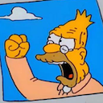 | `abe-clouds.png` | `:abe-clouds:` |
|  | `ack.png` | `:ack:` |
|  | `air-quotes.gif` | `:air-quotes:` |
|  | `all-the-things.jpg` | `:all-the-things:` |
|  | `announce.png` | `:announce:` |
| 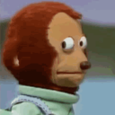 | `awkward.png` | `:awkward:` |
| 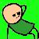 | `aww-yeah.gif` | `:aww-yeah:` |
|  | `banana-dance.gif` | `:banana-dance:` |
|  | `bueller.png` | `:bueller:` |
|  | `canvas-party.gif` | `:canvas-party:` |
|  | `check-failed.png` | `:check-failed:` |
|  | `check-passed.png` | `:check-passed:` |
| 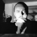 | `clappa.gif` | `:clappa:` |
| 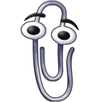 | `clippy.png` | `:clippy:` |
| 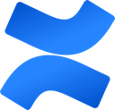 | `confluence.png` | `:confluence:` |
| 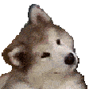 | `confused-dog.gif` | `:confused-dog:` |
| 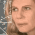 | `confused-numbers.gif` | `:confused-numbers:` |
| 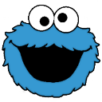 | `cookie-monster.png` | `:cookie-monster:` |
| 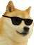 | `cool-doge.gif` | `:cool-doge:` |
| 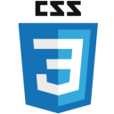 | `css.png` | `:css:` |
|  | `deal-with-it-parrot.gif` | `:deal-with-it-parrot:` |
| 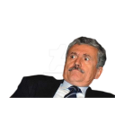 | `do-not-want.png` | `:do-not-want:` |
| 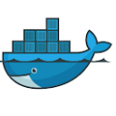 | `docker.png` | `:docker:` |
|  | `doit.gif` | `:doit:` |
| 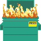 | `dumpster-fire.gif` | `:dumpster-fire:` |
|  | `elmo-fire.gif` | `:elmo-fire:` |
|  | `excellent.gif` | `:excellent:` |
|  | `excited-conan.gif` | `:excited-conan:` |
|  | `facepalm.png` | `:facepalm:` |
| 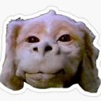 | `falkor.jpg` | `:falkor:` |
| 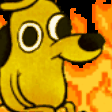 | `fire-intensifies.gif` | `:fire-intensifies:` |
| 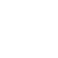 | `fist-bump.gif` | `:fist-bump:` |
| 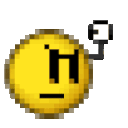 | `fist-shake.gif` | `:fist-shake:` |
| 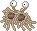 | `fsm.gif` | `:fsm:` |
| 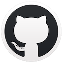 | `github.png` | `:github:` |
|  | `goodnews.png` | `:goodnews:` |
| 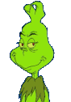 | `grinch.gif` | `:grinch:` |
| 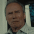 | `grizzled.gif` | `:grizzled:` |
|  | `heart-smile.png` | `:heart-smile:` |
|  | `heh-heh-heh.gif` | `:heh-heh-heh:` |
| 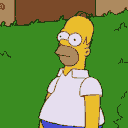 | `homer-bushes.gif` | `:homer-bushes:` |
|  | `jail.png` | `:jail:` |
|  | `jira-2.png` | `:jira-2:` |
|  | `jira.png` | `:jira:` |
|  | `js.png` | `:js:` |
|  | `kip-yes.gif` | `:kip-yes:` |
|  | `let-me-in.gif` | `:let-me-in:` |
| 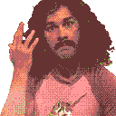 | `magic.gif` | `:magic:` |
|  | `make-it-so.gif` | `:make-it-so:` |
| 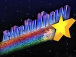 | `more-you-know.png` | `:more-you-know:` |
|  | `nod.gif` | `:nod:` |
| 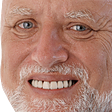 | `old-guy.png` | `:old-guy:` |
| 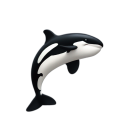 | `orca.png` | `:orca:` |
| 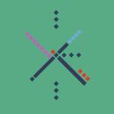 | `pdx.jpg` | `:pdx:` |
|  | `pendo.png` | `:pendo:` |
| 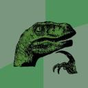 | `philosoraptor.jpg` | `:philosoraptor:` |
| 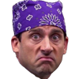 | `prisonmike.png` | `:prisonmike:` |
| 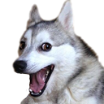 | `pun-dog.png` | `:pun-dog:` |
| 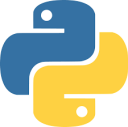 | `python.png` | `:python:` |
| 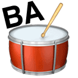 | `rimshot.gif` | `:rimshot:` |
|  | `saved-for-later.png` | `:saved-for-later:` |
| 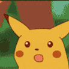 | `shocked-pikachu.gif` | `:shocked-pikachu:` |
| 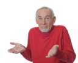 | `shrug.png` | `:shrug:` |
|  | `slack-canvas.png` | `:slack-canvas:` |
|  | `slack-hearts.png` | `:slack-hearts:` |
|  | `slack-intensifies.gif` | `:slack-intensifies:` |
|  | `slack-love.gif` | `:slack-love:` |
|  | `slack-sparkle.png` | `:slack-sparkle:` |
| 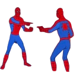 | `spiderman-pointing.png` | `:spiderman-pointing:` |
| 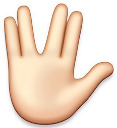 | `spock.jpg` | `:spock:` |
| 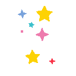 | `stars.gif` | `:stars:` |
|  | `stonks.png` | `:stonks:` |
|  | `success.png` | `:success:` |
|  | `suspicious.gif` | `:suspicious:` |
|  | `take-my-money.jpg` | `:take-my-money:` |
| 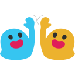 | `teamwork.png` | `:teamwork:` |
|  | `thinking.png` | `:thinking:` |
|  | `this-is-fine.gif` | `:this-is-fine:` |
| 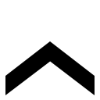 | `this.gif` | `:this:` |
|  | `this.png` | `:this:` |
| 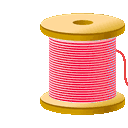 | `thread-party.gif` | `:thread-party:` |
| 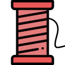 | `thread-police.gif` | `:thread-police:` |
| 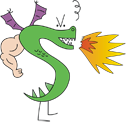 | `trogdor.png` | `:trogdor:` |
| 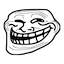 | `trollface.png` | `:trollface:` |
| 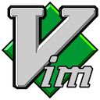 | `vim.png` | `:vim:` |
|  | `vscode.png` | `:vscode:` |
|  | `whoa.png` | `:whoa:` |
|  | `woohoo.png` | `:woohoo:` |
