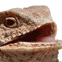

# Slack Emojis

This is a personal collection of curated Slack emojis for use in my own Slack workspaces.

## Contents

This repository contains the following files:

- `emojis/`: This directory contains all of the emoji image files.
- `generate-readme.md`: This script takes the contents in `_README.md`, appends to it a list of the image files in `emojis/`, and overrwrites the contents of `README.md`.
- `README.md`: The repository's README file. This file is generated by running `generate-readme.sh`. This file will be overwritten by the script to generate it.
- `_README.md`: The static content for the repository's README file. Update this file for README content.

## Emojis

| Emoji | File Name | Default Tag |
| ----- | --------- | ----------- |
|  | `abe-clouds.png` | `:abe-clouds:` |
|  | `announce.png` | `:announce:` |
|  | `awkward.png` | `:awkward:` |
|  | `canvas-party.gif` | `:canvas-party:` |
|  | `confused-dog.gif` | `:confused-dog:` |
|  | `do-not-want.png` | `:do-not-want:` |
|  | `fist-bump.gif` | `:fist-bump:` |
|  | `grizzled.gif` | `:grizzled:` |
|  | `heart-smile.png` | `:heart-smile:` |
|  | `hehhehheh.gif` | `:hehhehheh:` |
|  | `jail.png` | `:jail:` |
|  | `nod.gif` | `:nod:` |
|  | `old-guy.png` | `:old-guy:` |
|  | `philosoraptor.jpg` | `:philosoraptor:` |
|  | `pun-dog.png` | `:pun-dog:` |
|  | `shocked-pikachu.gif` | `:shocked-pikachu:` |
|  | `slack-canvas.png` | `:slack-canvas:` |
|  | `slack-hearts.png` | `:slack-hearts:` |
|  | `slack-intensifies.gif` | `:slack-intensifies:` |
|  | `slack-love.gif` | `:slack-love:` |
|  | `slack-sparkle.png` | `:slack-sparkle:` |
|  | `stars.gif` | `:stars:` |
|  | `teamwork.png` | `:teamwork:` |
|  | `thinking.png` | `:thinking:` |
|  | `this.png` | `:this:` |
|  | `thread-party.gif` | `:thread-party:` |
|  | `thread-police.gif` | `:thread-police:` |
|  | `trogdor.png` | `:trogdor:` |
|  | `trollface.png` | `:trollface:` |
|  | `woohoo.png` | `:woohoo:` |
